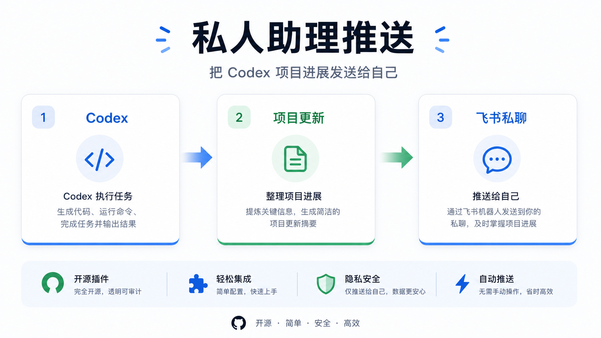

# Feishu for Codex

## 这是什么

这个插件适合把 Codex 的工作结果沉淀到飞书：

- 给自己发送项目日报、周报或测试消息
- 检索飞书 Docs / Wiki，让 Codex 生成项目报告
- 将报告写回飞书 Docx，并把链接发到飞书
- 可选把项目状态同步到 Bitable / 多维表格
- 可选让飞书消息触发本地 Codex 执行



最推荐先跑通「私人助理推送」。它需要的配置最少，也最容易验证：能收到测试消息，就说明应用身份、接收人 ID 和消息权限已经通了。

## 适合谁

- 使用 Codex、飞书和 GitHub 的独立开发者
- 希望把 AI 编码进展自动发到飞书的小团队
- 想把项目进展沉淀到飞书文档和多维表格的产品 / 工程团队

如果你主要想在飞书里远程操作本机 Claude Code / Codex CLI，可以同时参考 [lark-channel-bridge](https://github.com/zarazhangrui/lark-coding-agent-bridge)。本项目更聚焦「Codex 使用飞书原生能力」。

## 5 分钟跑通私人助理推送

### 1. 安装

```bash
git clone https://github.com/aipmer/plugins-codex-feishu.git
cd plugins-codex-feishu
cp .env.example .env
npm install
```

### 2. 配置飞书应用

在飞书开放平台创建「企业自建应用」，至少准备：

- `App ID`
- `App Secret`
- 你的接收人 `open_id`

最小权限：

- `im:message`
- `im:message:send_as_bot`

编辑本地 `.env`：

```env
FEISHU_APP_ID=cli_xxx
FEISHU_APP_SECRET=xxx
FEISHU_DEFAULT_RECEIVE_ID=ou_xxxxx
FEISHU_DEFAULT_RECEIVE_ID_TYPE=open_id
FEISHU_DEFAULT_UPDATE_MODE=weekly
```

注意：

- `FEISHU_APP_ID` 是「哪个飞书应用发消息」
- `FEISHU_DEFAULT_RECEIVE_ID` 是「消息发给谁」
- 私聊建议使用 `open_id`，不要把 `App ID` 当成接收人 ID

### 3. 检查配置

```bash
npm run feishu:doctor
```

如果只想先验证消息推送，`FEISHU_USER_ACCESS_TOKEN` 缺失可以暂时忽略。它只影响 Docs/Wiki、Docx 写回和 Bitable。

### 4. 发送测试消息

```bash
npm run feishu:project-update -- --test --send --confirm
```

收到飞书私聊消息后，再发送项目更新：

```bash
npm run feishu:project-update -- \
  --send \
  --confirm \
  --title "Codex 周报" \
  --file ./plugins/feishu/skills/feishu/examples/project-update-template.md
```

## 进阶：项目报告写回飞书文档

这条链路会读取 Git 项目进展，检索飞书 Docs / Wiki，让 Codex 生成报告，写回飞书 Docx，再把文档链接发给你。


先完成用户授权：

```bash
npm run feishu -- auth
```

打开命令输出的 `AUTH_URL`，授权成功后会写入本地：

```env
FEISHU_USER_ACCESS_TOKEN=xxx
FEISHU_USER_REFRESH_TOKEN=xxx
```

预览报告：

```bash
npm run feishu -- report --preview \
  --mode weekly \
  --workspace /path/to/project \
  --query "项目名称"
```

写回 Docx 并发送私聊：

```bash
npm run feishu -- report \
  --mode weekly \
  --workspace /path/to/project \
  --query "项目名称" \
  --write-doc \
  --send \
  --confirm
```

说明：

- `--preview` 是默认安全模式，不写飞书
- 所有真实写入都必须加 `--confirm`
- 用户 access token 过期时，会自动用 `FEISHU_USER_REFRESH_TOKEN` 续期并重试

## 进阶：Bitable 项目状态表

如果你想把项目状态同步到飞书多维表格，先创建标准表：

```bash
npm run feishu -- bitable-bootstrap --preview --owner "Your Name"
npm run feishu -- bitable-bootstrap --confirm --owner "Your Name"
```

它会创建 `Codex Project Operations` Base 和 `Project Status` 表，并写入本地 `.env`：

```env
FEISHU_PROJECT_NAME=Feishu for Codex
FEISHU_PROJECT_OWNER=Your Name
FEISHU_BITABLE_APP_TOKEN=bascn_xxxxx
FEISHU_BITABLE_TABLE_ID=tbl_xxxxx
```

然后执行：

```bash
npm run feishu -- report \
  --mode weekly \
  --workspace /path/to/project \
  --query "项目名称" \
  --write-doc \
  --bitable \
  --send \
  --confirm
```

## 可选能力

### 飞书消息机器人

适合让飞书私聊或群消息触发本地 Codex。出于安全考虑，从 `v1.1.0` 开始必须配置 owner 或白名单，否则 bot 不会执行本地命令。

```env
FEISHU_BOT_OWNER_OPEN_ID=ou_xxxxx
FEISHU_DEFAULT_WORKSPACE=/absolute/path/to/your/workspace
FEISHU_CODEX_COMMAND="node plugins/feishu/scripts/feishu-codex-runner.js"
FEISHU_RUNNER_COMMAND="codex exec"
```

启动：

```bash
npm run feishu:bot
```

详细示例见：[消息机器人快速接入](./plugins/feishu/skills/feishu/examples/quickstart-message-bot.md)。

### Webhook 事件订阅

适合接收飞书开放平台事件回调，例如 `url_verification`、消息事件和加密事件体。

```bash
npm run feishu -- webhook --self-test
```

详细说明见：[Webhook 配置](./plugins/feishu/skills/feishu/reference/webhook.md)。

### macOS 后台常驻

当前 service 管理优先支持 macOS `launchd`：

```bash
npm run feishu -- start
npm run feishu -- status
npm run feishu -- stop
```

## 常用命令

```bash
npm run feishu -- help
npm run feishu:doctor
npm run feishu:project-update -- --test --send --confirm
npm run feishu -- auth
npm run feishu -- report --preview --mode weekly --query "project name"
npm run feishu -- bitable-bootstrap --preview --owner "Your Name"
npm run feishu -- webhook --self-test
```

## 常见问题

### open_id 和 App ID 有什么区别？

- `FEISHU_APP_ID=cli_xxx`：飞书应用身份，用来发消息、换 token
- `open_id=ou_xxxxx`：飞书用户身份，用来指定消息接收人

两者不能混用。

### 为什么 `doctor` 提示缺少 `FEISHU_USER_ACCESS_TOKEN`？

只做私聊推送时可以先忽略。需要 Docs/Wiki 检索、Docx 写回或 Bitable 写入时，再运行：

```bash
npm run feishu -- auth
```

### 为什么 bot 不执行本地命令？

需要至少配置一项访问控制：

```env
FEISHU_BOT_OWNER_OPEN_ID=ou_xxxxx
FEISHU_BOT_ADMINS=ou_xxxxx
FEISHU_BOT_ALLOWED_USERS=ou_xxxxx
FEISHU_BOT_ALLOWED_CHATS=oc_xxxxx
```

默认拒绝执行是为了避免飞书消息意外触发本地命令。

## 安装到 Codex

普通用户推荐直接在 Codex 里添加插件市场：

- Source：`https://github.com/aipmer/plugins-codex-feishu.git`
- Git reference：`main`
- Sparse path：`plugins/feishu`

如果当前 Codex 版本需要 repo-local marketplace 文件：

- Marketplace path：`.agents/plugins/marketplace.json`

开发者本地同步：

```bash
./scripts/sync-local-plugin.sh
```

## 本地验证

修改插件后建议运行：

```bash
bash scripts/smoke-test.sh
bash scripts/check-sensitive-values.sh
```

## 延伸阅读

- [CHANGELOG](./CHANGELOG.md)
- [贡献指南](./CONTRIBUTING.md)
- [开发任务记录](./docs/dev_task.md)
- [认证说明](./plugins/feishu/skills/feishu/reference/auth.md)
- [Bitable 指南](./plugins/feishu/skills/feishu/reference/bitable.md)
- [消息推送示例](./plugins/feishu/skills/feishu/examples/project-digest-push.md)
