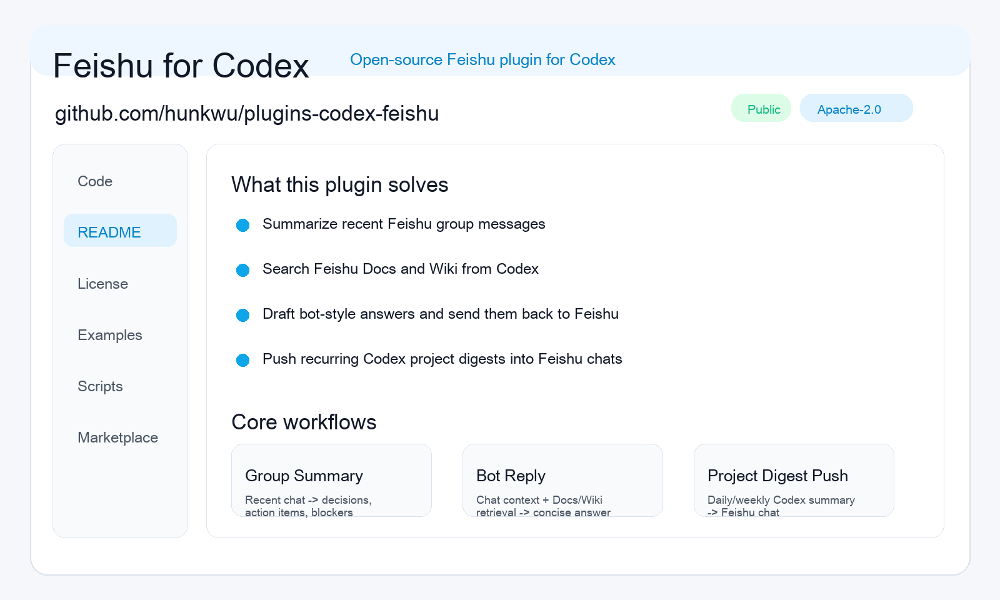

# Feishu for Codex

Open-source Feishu plugin for Codex, designed for high-frequency team collaboration workflows.

[中文说明](./README.zh-CN.md)

## Maintainer

- Personal site: [pmer.cn](https://pmer.cn)
- X: [@ai_pmer](https://x.com/ai_pmer)
- Related open-source project: [Codex Blue Book](https://github.com/hunkwu/book)

## Preview




## What it solves

- Summarize recent messages from Feishu group chats
- Search Feishu Docs and Wiki from Codex
- Draft bot-style answers and send them back to Feishu
- Push recurring Codex project digests into Feishu chats
- Avoid unstable upstream beta token flows by using a local stable HTTP-backed MCP implementation

## Core scenarios

### 1. Group message summary

Turn recent chat history into:

- decisions
- action items
- blockers
- owners

### 2. Bot conversation reply

Use Feishu chat context plus Docs or Wiki retrieval to produce concise answers for a target chat.

### 3. Codex project digest push

Generate daily or weekly project summaries from Codex and push them into Feishu chats.

## Repository layout

```text
.agents/plugins/marketplace.json
plugins/feishu/
```

Use `plugins/feishu` as the sparse path when importing from Git.

## Install in Codex

In `Add Plugin Marketplace`:

- Source: `https://github.com/hunkwu/plugins-codex-feishu.git`
- Git reference: `main`
- Sparse path: `plugins/feishu`

If your Codex build expects a repo-local marketplace file, use:

- Marketplace path: `.agents/plugins/marketplace.json`

## Setup

1. Create a Feishu self-built app.
2. Add this redirect URI:

```text
http://localhost:3000/callback
```

3. Grant the scopes required by the open-source workflow:

- `im:chat`
- `im:message`
- `docx:document`
- `wiki:wiki`
- `wiki:wiki:readonly`
- `docs:document:import`
- `drive:drive`
- `contact:user.id:readonly`
- `auth:user.id:read`
- `offline_access`

4. Export credentials:

```bash
export FEISHU_APP_ID="cli_xxx"
export FEISHU_APP_SECRET="xxx"
```

5. Generate an authorization URL:

```bash
plugins/feishu/scripts/generate-feishu-auth-url.sh
```

6. After browser authorization, exchange the callback code:

```bash
plugins/feishu/scripts/exchange-feishu-code.sh --code "<callback_code>"
```

7. Export the returned token:

```bash
export FEISHU_USER_ACCESS_TOKEN="<oauth_access_token>"
```

8. Run a quick environment check:

```bash
plugins/feishu/scripts/doctor-feishu-auth.sh
```

## Stable runtime

The default `lark-mcp` entry in `.mcp.json` uses the local HTTP-backed implementation in:

- `plugins/feishu/scripts/feishu_http_mcp.py`

The upstream beta server is preserved as `lark-mcp-official-beta` for comparison and debugging, but it is not the recommended production path.

## Official workflow examples

- [Group message summary](./plugins/feishu/skills/feishu/examples/group-summary.md)
- [Bot conversation reply](./plugins/feishu/skills/feishu/examples/bot-reply.md)
- [Codex project digest push](./plugins/feishu/skills/feishu/examples/project-digest-push.md)

## Notes

- Tokens are expected to stay in environment variables by default and are not written into repo files.
- The stable local MCP directly wraps the high-frequency IM, Docs, Wiki, and Contacts flows.
- Less common endpoints can still be reached through `feishu_openapi_request`.
- The repository is intended to be importable directly from GitHub as a Codex plugin marketplace source.

## Related Project

- [hunkwu/book](https://github.com/hunkwu/book) - Codex Blue Book, focused on Codex workflows, multi-surface orchestration, and AI-native product delivery.
