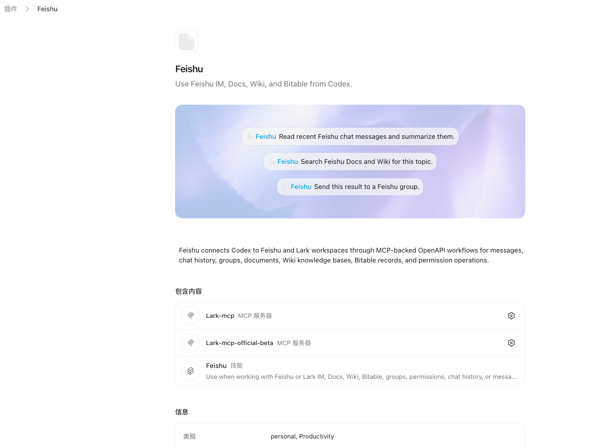
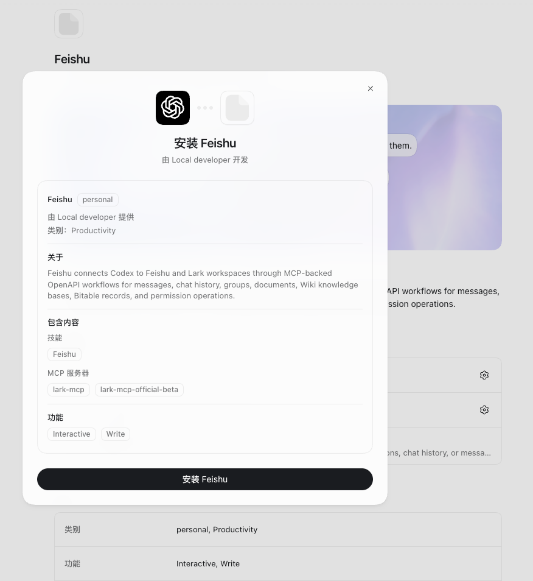

# Feishu for Codex

面向 Codex 的开源飞书插件，重点服务于高频团队协作场景，而不是作为 Codex 移动端的聊天替代品。

[English README](./README.md)

## 维护者

- 个人站点：[pmer.cn](https://pmer.cn)
- X 账号：[@ai_pmer](https://x.com/ai_pmer)
- 关联开源项目：[Codex 蓝皮书](https://github.com/hunkwu/book)

## 预览






## 解决什么问题

- 总结飞书群聊最近消息
- 在 Codex 里搜索飞书文档和知识库
- 生成机器人式回复并回推到飞书
- 将 Codex 项目日报、周报推送到飞书私人助理或群聊
- 接收飞书事件订阅 Webhook，用于机器人被动触发和群消息入口
- 用本地稳定 HTTP MCP 实现，绕开上游 beta token 链路不稳定的问题

更准确地说，这个插件优先解决「团队协作入口」问题：群消息触发、结果分发、文档与知识库联动、项目播报，以及带权限边界的组织工作流闭环。

## 5 分钟私人助理推送

如果你希望让 Codex 生成项目更新，并推送到自己的飞书私人助理私聊，优先走这条路径。

```bash
git clone https://github.com/aipmer/plugins-codex-feishu.git
cd plugins-codex-feishu
cp .env.example .env
npm install
```

编辑 `.env`：

```env
FEISHU_APP_ID=cli_xxx
FEISHU_APP_SECRET=xxx
FEISHU_DEFAULT_RECEIVE_ID=ou_xxxxx
FEISHU_DEFAULT_RECEIVE_ID_TYPE=open_id
FEISHU_DEFAULT_UPDATE_MODE=weekly
```

先验证凭证，并预览消息：

```bash
npm run feishu:doctor
npm run feishu:project-update -- --preview --mode weekly --file ./plugins/feishu/skills/feishu/examples/project-update-template.md
```

正式发送前，先发一条短测试消息：

```bash
npm run feishu:project-update -- --test --send --confirm
npm run feishu:project-update -- --send --confirm --title "Weekly Update" --file ./digest.md
```

常用变体：

```bash
npm run feishu:project-update -- --dry-run-json --mode daily --message "已完成：发布文档"
npm run feishu:project-update -- --preview --receive-id ou_xxxxx --receive-id-type open_id --file ./digest.md
```

如果配置缺失，脚本会输出缺少的项目和下一步设置指引。`FEISHU_APP_ID` 是发送消息的应用身份；`open_id` 是接收消息的用户身份。真实发送必须带 `--confirm`。

## 5 分钟消息机器人快速接入

如果你希望从这个 GitHub 仓库快速验证飞书消息对接，优先走这条路径。它使用飞书官方长连接模式，不需要公网 HTTPS 回调地址。

```bash
git clone https://github.com/aipmer/plugins-codex-feishu.git
cd plugins-codex-feishu
cp .env.example .env
npm install
```

编辑 `.env`：

```env
FEISHU_APP_ID=cli_xxx
FEISHU_APP_SECRET=xxx
FEISHU_BOT_REPLY_TEXT=收到，我已接入 Codex Feishu 插件。
FEISHU_DEFAULT_WORKSPACE=/absolute/path/to/your/workspace
FEISHU_CODEX_COMMAND="node plugins/feishu/scripts/feishu-codex-runner.js"
FEISHU_CODEX_COMMAND_MODE=stdin
FEISHU_RUNNER_COMMAND="codex exec"
```

如果只想验证机器人连通性，可以只配 `FEISHU_BOT_REPLY_TEXT`。如果要启用当前版本的最小桥接能力，需要额外配置 `FEISHU_CODEX_COMMAND`，让收到的文本消息转成一次本地命令执行。当前已支持最小命令集：`/help`、`/new`、`/status`、`/ids`、`/stop`、`/cd <path>`。

本地执行协议：

- `FEISHU_CODEX_COMMAND_MODE=stdin`：默认模式。机器人会把 `Session`、`Workspace` 和原始消息文本写到标准输入。
- `FEISHU_CODEX_COMMAND_MODE=env`：不写 stdin，只通过环境变量传参。可用变量包括 `FEISHU_MESSAGE_TEXT`、`FEISHU_MESSAGE_PAYLOAD`、`FEISHU_SESSION_KEY`、`FEISHU_SESSION_WORKSPACE`、`FEISHU_RUN_ID`。

推荐配置是把 `FEISHU_CODEX_COMMAND` 指到仓库自带的 runner，再用 `FEISHU_RUNNER_COMMAND` 指向真实下游命令。这样后续即使桥接协议扩展，也只需要保持 runner 向后兼容。

最小访问控制：

- `FEISHU_BOT_OWNER_OPEN_ID`：owner。配置后，owner 可直接触发执行。
- `FEISHU_BOT_ADMINS`：管理员 `open_id` 列表，逗号分隔。
- `FEISHU_BOT_ALLOWED_USERS`：允许触发执行的用户 `open_id` 列表，逗号分隔。
- `FEISHU_BOT_ALLOWED_CHATS`：允许触发执行的群或会话 `chat_id` 列表，逗号分隔。

如果这四项都不配，bot 默认开放；只要配置了任意一项，就会进入受控模式，未授权消息只会收到拒绝提示，不会触发本地命令。

当前队列行为：

- 同一会话只会串行执行一个本地任务。
- 如果新消息到达时当前会话仍在执行，新消息会先进入当前会话队列，而不是直接丢弃。
- 当前版本已经支持多条排队消息按顺序自动 drain。
- `FEISHU_BOT_BATCH_WINDOW_MS` 可选开启短时间批处理窗口。大于 `0` 时，窗口内连续进入队列的消息会合并成一个本地任务。

## 5 分钟 Codex Bridge 验证

如果你想先在本地验证「消息 -> runner -> 下游命令 -> 回复文本」这条桥接链路，可以先把下游命令换成仓库自带的 echo 脚本：

```env
FEISHU_CODEX_COMMAND="node plugins/feishu/scripts/feishu-codex-runner.js"
FEISHU_RUNNER_COMMAND="node plugins/feishu/scripts/feishu-codex-echo.js"
FEISHU_CODEX_COMMAND_MODE=env
```

这样机器人不会真的调用 Codex，而是把收到的消息、会话和工作区信息原样打印回来，适合先验证桥接协议、会话隔离和回复链路。

在飞书开放平台中：

1. 创建企业自建应用，并复制 `App ID` / `App Secret`。
2. 进入「事件与回调」。
3. 订阅方式选择「使用长连接接收事件」。
4. 订阅 `im.message.receive_v1`。
5. 开通 `im:message` 和 `im:message:send_as_bot`。
6. 发布应用，并把机器人加入测试群。

验证：

```bash
npm run feishu:doctor
npm run feishu:bot
```

终端出现 `ws client ready` 后，在群里发一条文本消息，例如「请总结今天的项目进展」。如果使用上面的 echo 验证配置，机器人应回复类似：

```text
Feishu Codex Echo
Session: chat:...
Workspace: /absolute/path/to/your/workspace
Message: 请总结今天的项目进展
```

确认桥接没问题后，再把 `FEISHU_RUNNER_COMMAND` 切回真实命令，例如 `codex exec`。

bot 会在每个会话里保存一小段最近消息记录，并忽略重复投递的飞书 `message_id`，避免飞书重试投递造成重复本地执行或重复回复。

`/status` 现在会带出当前 `chat_id`、发送者 `open_id`、bridge command、runner command 和本地 service 摘要。`/ids` 会直接打印当前会话标识，并给出可直接复制的 `FEISHU_BOT_ALLOWED_CHATS`、`FEISHU_BOT_ALLOWED_USERS` 配置片段。

统一 CLI 入口：

- `npm run feishu -- doctor`
- `npm run feishu -- bot`
- `npm run feishu -- start`
- `npm run feishu -- stop`
- `npm run feishu -- restart`
- `npm run feishu -- status`
- `npm run feishu -- runner --print-payload`
- `npm run feishu -- push --preview --message "已完成：发布文档"`
- `npm run feishu -- webhook --self-test`

本地 service 管理：

- 当前版本优先支持 macOS `launchd`
- `start` 会生成或更新 state 目录下的 `service/launchd.plist`
- `status` 会结合 `launchctl print` 和 `service/service.json` 输出人类可读摘要
- 默认日志路径：
  - `service/stdout.log`
  - `service/stderr.log`

真实凭证和飞书标识只保留在本地 `.env`。不要把真实 `FEISHU_APP_ID`、`FEISHU_APP_SECRET`、`FEISHU_USER_ACCESS_TOKEN`、`open_id`、`chat_id` 或 `message_id` 写进文档、示例、日志或截图。

完整指引：[Quickstart Message Bot](./plugins/feishu/skills/feishu/examples/quickstart-message-bot.md)

## 核心场景

### 1. 飞书群消息总结

把最近群消息整理成：

- 决策事项
- 待办事项
- 风险阻塞
- 责任人

### 2. 机器人式对话回复

结合飞书聊天上下文，以及 Docs / Wiki 检索结果，生成面向群聊或私聊的简洁回复。

### 3. Codex 项目总结推送

基于 Codex 项目进展自动生成日报或周报，并推送到飞书群。

### 4. Webhook 事件订阅

接收飞书开放平台事件订阅回调，支持：

- `url_verification` challenge 校验
- `Verification Token` 来源校验
- `X-Lark-Signature` 签名校验
- `Encrypt Key` 加密事件体解密
- 将事件输出到 stdout 或本地日志文件，便于后续接入 agent workflow

## 仓库结构

```text
.agents/plugins/marketplace.json
plugins/feishu/
```

通过 Git 导入时，稀疏路径使用 `plugins/feishu`。

## 在 Codex 中安装

普通用户推荐直接在 Codex 里通过 GitHub 仓库添加插件市场，不需要先手动执行 `git clone`。

在 `Add Plugin Marketplace` 中填写：

- Source：`https://github.com/aipmer/plugins-codex-feishu.git`
- Git reference：`main`
- Sparse path：`plugins/feishu`

如果当前 Codex 版本需要 repo-local marketplace 文件，则使用：

- Marketplace path：`.agents/plugins/marketplace.json`

添加成功后，插件会出现在 `Codex Community` 这个市场下。这个名称来自仓库内的 `.agents/plugins/marketplace.json`。

### Built by OpenAI / Codex Community / Personal 的区别

- `Built by OpenAI`：Codex 官方内置插件，通常由 OpenAI 维护。
- `Codex Community`：从这个 GitHub 仓库添加的社区插件市场，适合开源分发和普通用户安装。
- `Personal`：用户本机个人插件目录，适合自己本地开发、调试或未公开插件。

一般用户只需要安装 `Codex Community` 这一份，不需要再安装到 `Personal`。如果你要参与开发或修改插件源码，再使用下面的开发者方式。

### 开发者本地安装

如果你要贡献代码、调试脚本或修改插件，可以先克隆仓库：

```bash
git clone https://github.com/aipmer/plugins-codex-feishu.git
cd plugins-codex-feishu
scripts/smoke-test.sh
```

如果需要把仓库内插件同步到本机个人插件目录：

```bash
scripts/sync-local-plugin.sh
```

这会把 `plugins/feishu` 单向同步到默认的本地运行时目录。普通安装用户不需要执行这一步。

## 配置步骤

1. 创建飞书自建应用。
2. 配置回调地址：

```text
http://localhost:3000/callback
```

3. 为开源版默认工作流开通这些权限：

- `im:chat`
- `im:message`
- `docx:document`
- `wiki:wiki`
- `wiki:wiki:readonly`
- `docs:document:import`
- `drive:drive`
- `contact:user.id:readonly`
- `auth:user.id:read`
- `offline_access`

4. 导出应用凭据：

```bash
export FEISHU_APP_ID="cli_xxx"
export FEISHU_APP_SECRET="xxx"
```

5. 生成授权链接：

```bash
plugins/feishu/scripts/generate-feishu-auth-url.sh
```

6. 浏览器授权后，用回调里的 `code` 换 token：

```bash
plugins/feishu/scripts/exchange-feishu-code.sh --code "<callback_code>"
```

7. 导出返回的 token：

```bash
export FEISHU_USER_ACCESS_TOKEN="<oauth_access_token>"
```

8. 运行环境检查：

```bash
plugins/feishu/scripts/doctor-feishu-auth.sh
```

## Webhook 服务

本仓库内置轻量 Webhook 接收服务：

```bash
export FEISHU_VERIFICATION_TOKEN="xxx"
export FEISHU_ENCRYPT_KEY="xxx"

plugins/feishu/scripts/feishu_webhook_server.py
```

默认监听：

```text
http://127.0.0.1:3000/webhook/feishu
```

飞书开放平台配置时需要使用公网 HTTPS 地址，例如：

```text
https://your-public-domain.example/webhook/feishu
```

配置位置：飞书开放平台自建应用 -> `事件与回调` -> `加密策略` 和 `事件订阅`。

详细指引见：

- [Webhook 事件订阅](./plugins/feishu/skills/feishu/reference/webhook.md)
- [Webhook 到机器人回复示例](./plugins/feishu/skills/feishu/examples/webhook-to-reply.md)
- [产品路线图](./docs/roadmap.md)

## 私人助理推送

如果希望把 Codex 日报、周报或执行总结推送到个人私聊，需要使用接收人的 `open_id`，不是应用的 `App ID`。

插件默认展示提示词已优先面向这个流程：

```text
Draft a Codex project update and send it to Feishu.
```

- `FEISHU_APP_ID`：发送消息的飞书自建应用，例如 `cli_xxx`
- `open_id`：接收消息的用户，例如 `ou_xxxxx`
- `chat_id`：群聊或私聊会话，例如 `oc_xxxxx`

如果判断私人推送还没配置好，建议先引导用户完成：

1. 在本地运行环境配置 `FEISHU_APP_ID` 和 `FEISHU_APP_SECRET`。
2. 运行 `plugins/feishu/scripts/doctor-feishu-auth.sh` 验证应用凭证和 tenant token。
3. 获取接收人的 `open_id`。
4. 先发送一条短测试消息，再发送完整 Codex 项目更新。
5. 如果你的默认节奏是日报或周报，再配置 `FEISHU_DEFAULT_UPDATE_MODE`。

推荐命令路径：

```bash
npm run feishu:project-update -- --preview --mode weekly --file ./plugins/feishu/skills/feishu/examples/project-update-template.md
npm run feishu:project-update -- --dry-run-json --mode daily --message "已完成：发布文档"
npm run feishu:project-update -- --test --send --confirm
npm run feishu:project-update -- --send --confirm --title "Weekly Update" --file ./digest.md
```

获取 `open_id` 的推荐方式：

1. 让目标用户先给机器人发一条私聊消息。
2. 在飞书开放平台事件日志里查看 `event.sender.sender_id.open_id`。
3. 或在具备 `contact:user.id:readonly` 权限时，用邮箱解析用户 ID。

常见失败提示：

- 缺少应用凭证：配置 `FEISHU_APP_ID` 和 `FEISHU_APP_SECRET`。
- 缺少接收人：配置 `FEISHU_DEFAULT_RECEIVE_ID` 或通过 `--receive-id` 传入。
- 接收人类型非法：目前只支持 `open_id` 和 `chat_id`。
- 权限不足：检查 `im:message`、`im:message:send_as_bot` 和租户审批。
- 已授权但仍无法投递：确认应用已发布，且接收人位于可见范围内。

详细说明见：

- [Authentication: App ID vs Recipient ID](./plugins/feishu/skills/feishu/reference/auth.md#app-id-vs-recipient-id)
- [Messages: Send Private Assistant Message](./plugins/feishu/skills/feishu/reference/messages.md#send-private-assistant-message)

## 本地验证

修改插件后建议运行：

```bash
scripts/smoke-test.sh
```

## 社区共建

欢迎提交真实使用经验和改进：

- [贡献指南](./CONTRIBUTING.md)
- [实战案例库](./case-studies/)
- [案例模板](./case-studies/TEMPLATE.md)

优先欢迎这些内容：

- Codex + 飞书 workflow 的真实踩坑和修复
- 你项目中有效的 `AGENTS.md` 规则
- AI 调优技巧、提示词和验证方法
- 独立开发者如何用 Codex 快速上线产品、拿到用户或赚到第一笔收入

## 稳定运行时

默认 `feishu-mcp` 入口使用本地稳定 HTTP 实现，核心脚本位于：

- `plugins/feishu/scripts/feishu_http_mcp.py`

默认插件运行时不再包含上游 beta server。推荐使用当前稳定的本地 HTTP 封装服务。

## 官方 workflow 示例

- [飞书群消息总结](./plugins/feishu/skills/feishu/examples/group-summary.md)
- [机器人式对话回复](./plugins/feishu/skills/feishu/examples/bot-reply.md)
- [Codex 项目总结推送](./plugins/feishu/skills/feishu/examples/project-digest-push.md)

## 说明

- 默认不把 token 写入仓库文件，建议只放在环境变量里。
- 稳定本地 MCP 已直接封装高频的 IM、Docs、Wiki、Contacts 能力。
- 更少用或更专门的接口仍然可以通过 `feishu_openapi_request` 调用。
- 这个仓库的目标是让用户可以直接用 GitHub 仓库地址导入 Codex 插件市场。

## 关联项目

- [hunkwu/book](https://github.com/hunkwu/book) - Codex 蓝皮书，聚焦 Codex 工作流、多端编排和 AI 原生产品落地。
